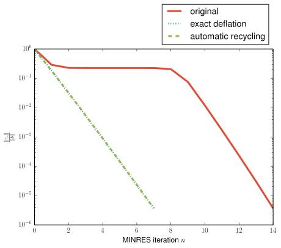

.. KryPy documentation master file, created by
   sphinx-quickstart on Fri Jun 21 17:54:43 2013.
   You can adapt this file completely to your liking, but it should at least
   contain the root `toctree` directive.

Welcome to KryPy's documentation!
=================================

What is KryPy and where is the code?
------------------------------------

KryPy is a Krylov subspace methods package for Python. If you're looking for
the source code or bug reports, take a look at `KryPy's github page
<https://github.com/andrenarchy/krypy>`_. These pages provide the
documentation of KryPy's API. The project was initiated by André Gaul while
researching Krylov subspace methods. The theoretical background as well as
applications of this software package can be found in the PhD thesis [Gau14]_.

KryPy allows Python users to easily use Krylov subspace methods, e.g., for solving
linear systems or eigenvalue problems. With its built-in deflation and
recycling capabilities it is suitable for advanced applications of Krylov
subspace methods (see :doc:`krypy.deflation` and :doc:`krypy.recycling`).
It is also ideal for experimenting with Krylov subspaces since you have access to
all data that is generated (e.g., Arnoldi/Lanczos relations), you can use
different orthogonalization algorithms (Lanczos short recurrences, modified
Gram-Schmidt, double modified Gram-Schmidt, Householder), compare subspaces via
angles, and much more. And if you need more: KryPy is free software, it's easy
to extend, and pull requests are more than welcome!

Contents
--------
.. toctree::
   :maxdepth: 3

   krypy
   bibliography

Getting started
---------------

Installation
~~~~~~~~~~~~
KryPy can be installed easily with the Python package installer by issuing
``pip install krypy``. Alternatively, it can be installed by downloading the
source from `KryPy's github page <https://github.com/andrenarchy/krypy>`_ and
then running ``python setup.py install``.

Solve a linear system
~~~~~~~~~~~~~~~~~~~~~
The following code uses MINRES to solves a linear system with an indefinite
diagonal matrix::

  from numpy import diag, linspace, ones
  import krypy

  # construct the linear system
  A = diag(linspace(1, 2, 20))
  A[0, 0] = -1e-5
  b = ones(20)
  sol, out = krypy.minres(A, b)

The variable ``sol`` contains the solution as a ``numpy.array``, ``out`` holds more
information like the residual norms etc.

For advanced usage, you can create a ``LinearSystem`` object to feed into the solver::

  from numpy import diag, linspace, ones
  from krypy.linsys import LinearSystem, Minres

  A = diag(linspace(1, 2, 20))
  A[0, 0] = -1e-5
  b = ones(20)

  linear_system = LinearSystem(A, b, self_adjoint=True)
  # solve the linear system (approximate solution is solver.xk)
  solver = Minres(linear_system)

Deflation
~~~~~~~~~
The vector :math:`e_1` can be used as a deflation vector to get rid of the small
negative eigenvalue :math:`-10^{-5}`::

  from krypy.deflation import DeflatedMinres
  dsolver = DeflatedMinres(linear_system, U=eye(20, 1))

Recycling
~~~~~~~~~
The deflation subspace can also be determined automatically with a recycling
strategy. Just for illustration, the same linear system is solved twice in the
following code::

  from krypy.recycling import RecyclingMinres

  # get recycling solver with approximate Krylov subspace strategy
  rminres = RecyclingMinres(vector_factory='RitzApproxKrylov')

  # solve twice
  rsolver1 = rminres.solve(linear_system)
  rsolver2 = rminres.solve(linear_system)

The convergence histories can be plotted by

::

  from matplotlib.pyplot import semilogy, show, legend
  semilogy(solver.resnorms, label='original')
  semilogy(dsolver.resnorms, label='exact deflation', ls='dotted')
  semilogy(rsolver2.resnorms, label='automatic recycling', ls='dashed')
  legend()
  show()

which results in the following figure.

Indices and tables
==================

* :ref:`genindex`
* :ref:`modindex`
* :ref:`search`

